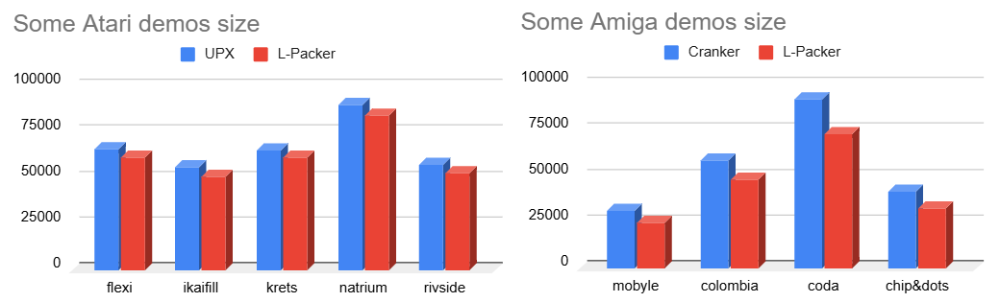

# L-Packer v0.93

L-Packer is an executable compressor designed for 64K-style demos. Since I couldn’t choose between my two favorite platforms, L-Packer works on both Atari and Amiga systems!

## The Idea

If you’re targeting a 4K demo, nothing beats Shrinkler (Amiga) or STrinkler (Atari).

However, for 40K or 64K demos, Shrinkler’s decompression speed becomes a problem — it can take up to 30 seconds before your demo even starts. For that size range, Atari users often rely on UPX, while Amiga users use Cranker. Unfortunately, both offer relatively poor compression ratios.

So there was a gap to fill — something in between: a packer with good decompression speed without sacrificing too much compression efficiency.
That’s where the idea for L-Packer came from!

## Key Features

* Balances good compression ratio with decent decompression speed
* Automatically try 3 compression algorithms on your exe (deflate, zx0, LZ4)
* Chooses the best algorithm for your target size (selecting the fastest depacker when possible)
* Supports both Atari and Amiga executables with a single tool
* Uses multi-threading to compress hunks with several algorithms in parallel for maximum speed
* Ability to pad final executable with random bytes

## Use Case

If you can accept about 5% less compression than Shrinkler, L-Packer is perfect for you!
It consistently beats UPX and Cranker in compression ratio, and can decompress a 64K demo in about 3–5 seconds.



## Usage

````
L-Packer v0.93(beta) by Leonard/Oxygene
Atari & Amiga executable cruncher

Usage:
        L-Packer <src> <dst> [-options]
Options:
        -t<x> : target size limit in KiB
        -pad : add random bytes to pad up to the target size
        -noflash : remove color flash when depacking
        -deflate : force DEFLATE as unique algorithm
        -zx0 : force ZX0 as unique algorithm
        -lz4 : force LZ4 as unique algorithm
        -v : verbose mode
````

## Exemple
Pack foo.exe as best as you can
````
  L-Packer foo.exe foo_packed.exe
````

Pack Colombia.exe, aiming 64KiB demo category, and pad to 64KiB using random bytes
````
  L-Packer Colombia.exe Colombia_packed.exe -t64 -pad
````

## Known Limitations

* Version 0.93 is a beta release — please test it and report any issues on GitHub.
* The Amiga version doesn’t yet have a fully compatible bootstrap, so please test it with your demo and share feedback.

## Source Code

The full source code will be released with version 1.0.
I’d like to gather community feedback first to improve and debug the tool.

## Credits

* Code & concept by Leonard / Oxygene
* Zopfli efficient Deflate compressor by Google
* Inflate 68k depacker by Keir Fraser
* ZX0 “Salvador” compressor & 68k decompressor by Emmanuel Marty
